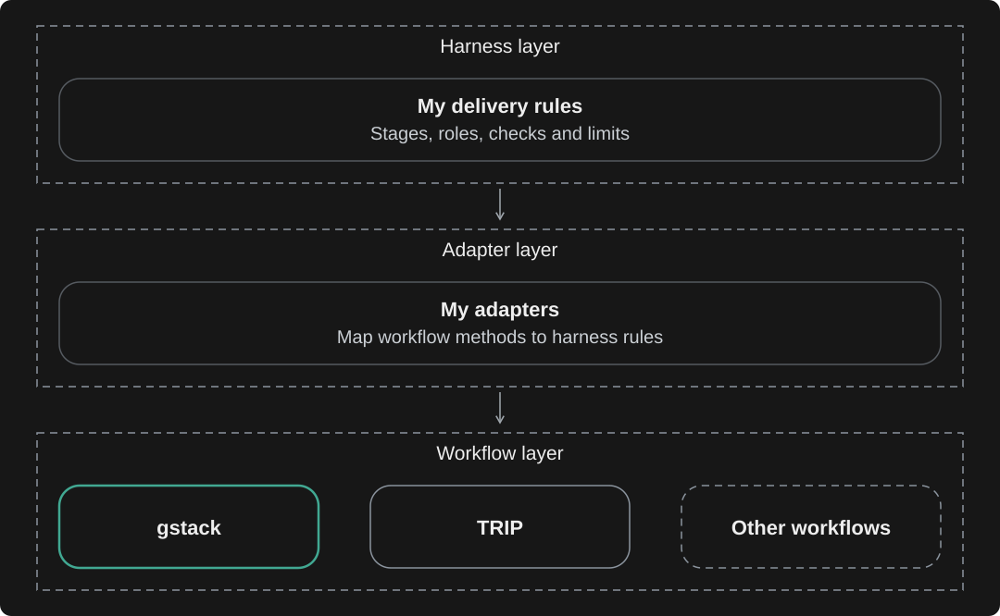
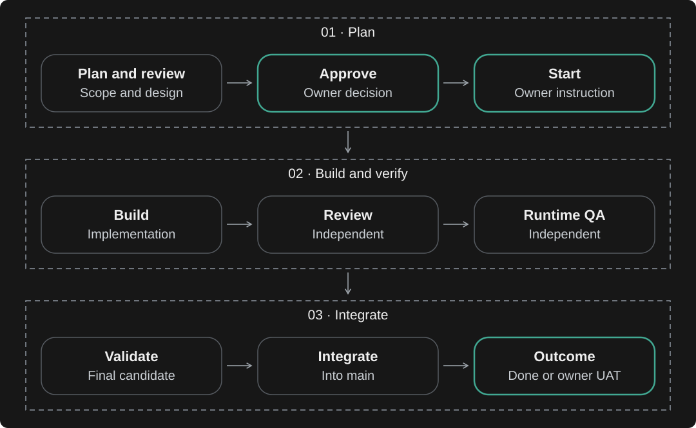

# Nadili Harness

**An AI development workflow that plans, builds, reviews and tests a change before integration.**

I built it for Nadili to coordinate coding agents from an idea to working software.
I approve the plan and start the work. The harness coordinates implementation, independent
review and testing, and brings decisions back to me when scope or limits need to change.

## Three layers

My harness owns the delivery rules, agent roles and checks. Adapters map a chosen workflow
onto those rules, preserving approval, independent verification and action limits.

[gstack](adapters/gstack/adapter.md) is active; [TRIP](adapters/TRIP/adapter.md)
is retained for legacy items. Other workflows represent possible future adapters.
Codex and Claude Code provide the agent execution environment.

## How it works

QA runs where applicable. Review or QA findings return to Build, followed by review and affected QA.
Retries stay within the approved budget.
Missing required evidence or exhausted limits stop the workflow. Human acceptance, when needed,
follows integration; production release is separate.

## What makes it useful

- **A second pair of eyes.** The implementer does not approve its own work.
- **Fixes stay accountable.** Review follows the actual code version and tracks earlier findings.
- **Work stays bounded.** Risk determines review depth; recorded attempts have explicit limits.
- **Agents share the machine safely.** Worktrees separate edits; execution leases coordinate heavy checks.

This portfolio snapshot includes source and selected tests from my private working project.

[One concrete example](docs/WALKTHROUGH.md) · [How the controls work](docs/DESIGN.md) · [Browse the files](FILE_GUIDE.md) · [Repository maintenance](MAINTENANCE.md)
