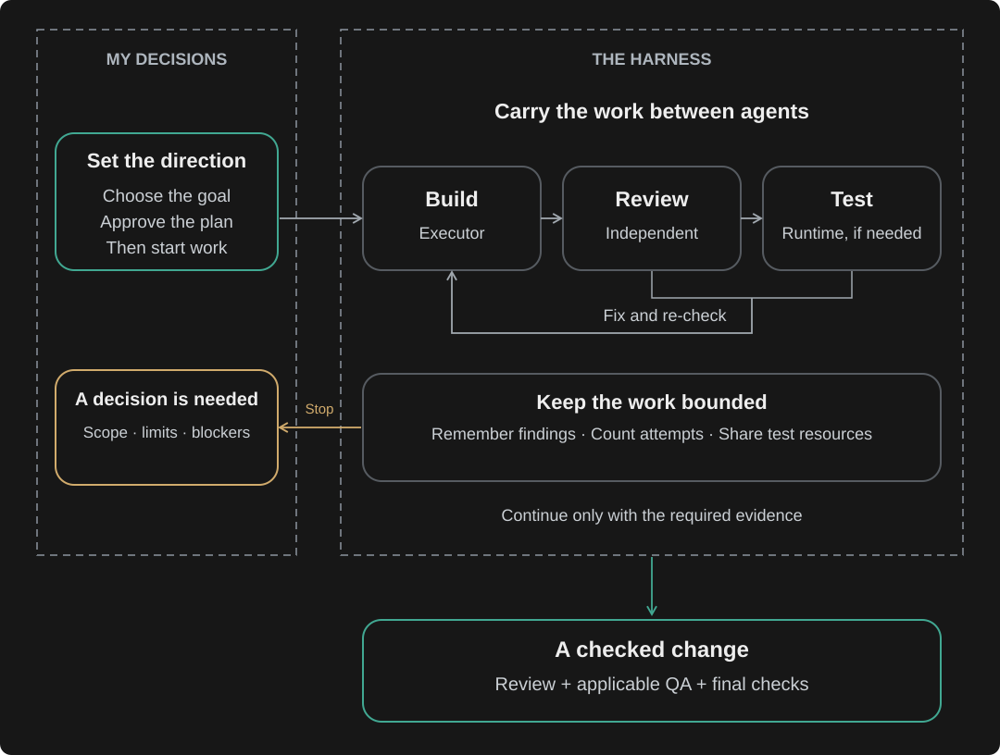

# I decide. The harness coordinates.

[Back to overview](../README.md)

I choose what to build. The harness moves work between agents, carries feedback back for fixes,
and stops when it needs a decision from me.

**Green:** I authorize the work; completed checks support the result. **Amber:** work stops for a decision.

[See the agents in action](WALKTHROUGH.md) · [Explore the implementation](../FILE_GUIDE.md)

A note on the limits

Some rules are checked by code; others depend on agents following their instructions.
The attempt counter covers recorded actions, not every possible tool call or the provider's
bill. Tests check those mechanisms; they do not prove every agent judgment correct or establish
a measured productivity gain.

[Review checks](../shared/tests/unit/test_codex_code_review.py) · [Attempt tracking](../shared/scripts/codex_orchestration_budget.py)

